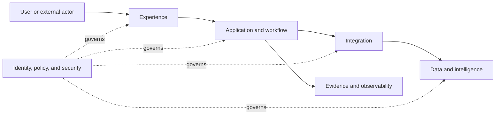

# Functional Architecture

> Status: Draft
> Canonical owner: Solution architect - name to be assigned
> Required reviewers: Business, data, security, integration, engineering, and operations owners
> Gate: G3
> Last reviewed: Not reviewed

## Functional domains

| Domain | Capabilities | Responsibility | Authoritative information or decision | External interfaces |
|---|---|---|---|---|
| [Experience, process, application, integration, data, AI, security, management, operations] | `CAP-NNN` | [Responsibility] | [Authority] | [Interfaces] |

## Functional flow

Replace the starter diagram with the project-specific functional view. Keep products out of this artifact.

## Functional contracts

| From | To | Purpose | Contract type | Authority transferred? | Failure responsibility |
|---|---|---|---|---|---|
| [Domain] | [Domain] | [Purpose] | [API/event/message/data/human] | [No or bounded authority] | [Owner] |

## Cross-cutting functions

Describe identity, policy, configuration, audit, observability, evidence, feature management, data governance, model governance, cost allocation, and lifecycle management without turning them into unowned shared concerns.
